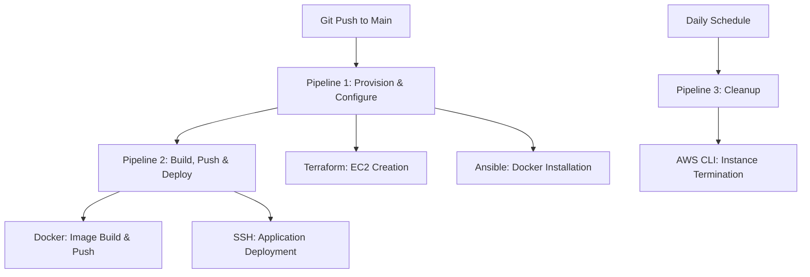

# CI/CD Pipeline with Jenkins, Terraform, Ansible & Docker

> **DevOps Internship Project** at [Konecta Egypt](https://konecta.com)  
> A comprehensive CI/CD solution demonstrating modern DevOps practices and infrastructure automation.

## 🚀 Project Overview

This project implements a complete CI/CD pipeline using industry-standard tools to automate infrastructure provisioning, application deployment, and resource cleanup. The solution demonstrates best practices in DevOps, Infrastructure as Code (IaC), and containerization.

## 🏗️ Architecture

The project consists of three interconnected Jenkins pipelines:



## 📋 Pipeline Details

### Pipeline 1: Provision & Configure
- **Trigger**: Git webhook on push to `main` branch
- **Infrastructure**: Terraform with S3 remote backend
- **Configuration**: Ansible playbook for Docker installation
- **Output**: EC2 instance with public IP and required tags

### Pipeline 2: Build, Push & Deploy
- **Trigger**: Auto-triggered after Pipeline 1 completion
- **Containerization**: Docker image build with custom Nginx
- **Registry**: Private Docker Hub integration
- **Deployment**: SSH-based container deployment

### Pipeline 3: Daily Cleanup
- **Trigger**: Scheduled daily at 12:00 AM Africa/Cairo
- **Purpose**: Terminate all ephemeral EC2 instances
- **Automation**: AWS CLI with tag-based filtering

## 🛠️ Technology Stack

| Tool | Purpose | Version |
|------|---------|---------|
| **Jenkins** | CI/CD Orchestration | Latest LTS |
| **Terraform** | Infrastructure as Code | 1.x |
| **Ansible** | Configuration Management | 2.x |
| **Docker** | Containerization | Latest |
| **AWS** | Cloud Provider | EC2, S3, DynamoDB |
| **Nginx** | Web Server | Alpine Linux |

## 📁 Project Structure

```
jenkins/
├── pipline/
│   ├── Jenkinsfile.provision      # Pipeline 1: Infrastructure
│   ├── Jenkinsfile.deploy         # Pipeline 2: Application
│   ├── Jenkinsfile.cleanup        # Pipeline 3: Resource cleanup
│   ├── Dockerfile                 # Nginx container definition
│   ├── terraform/
│   │   ├── main.tf               # EC2 instance configuration
│   │   ├── variables.tf          # Terraform variables
│   │   ├── outputs.tf            # Public IP output
│   │   ├── backend.tf            # S3 remote backend
│   │   ├── backend.hcl           # Backend configuration
│   │   └── terraform.tfvars      # Variable values
│   └── ansible/
│       └── playbook.yml          # Docker installation playbook
└── README.md
```

## 🚀 Getting Started

### Prerequisites

- Jenkins with required plugins
- AWS account with appropriate permissions
- Docker Hub account
- Terraform installed
- Ansible installed

### Jenkins Credentials Setup

Configure the following credentials in Jenkins:

1. **AWS_Creds**: AWS Access Key and Secret Key
2. **AWS_SSH_FILE**: Private SSH key for EC2 access
3. **DockerHub_cred**: Docker Hub username and password

### Pipeline Configuration

1. **Provision Pipeline**: Configure with webhook trigger
2. **Deploy Pipeline**: Set up parameterized build
3. **Cleanup Pipeline**: Configure with cron schedule `TZ=Africa/Cairo 0 0 * * *`

## 🔧 Key Features

### Infrastructure as Code
- **Terraform**: Complete AWS infrastructure definition
- **Remote State**: S3 backend with DynamoDB locking
- **Tagging Strategy**: Consistent resource tagging for lifecycle management

### Security Best Practices
- **Credential Management**: All secrets stored in Jenkins credentials
- **Least Privilege**: Minimal required AWS permissions
- **SSH Key Management**: Secure key-based authentication

### Containerization
- **Custom Images**: Nginx with build-specific content
- **Registry Integration**: Private Docker Hub repository
- **Version Tagging**: Build number and timestamp-based tags

### Automation
- **Idempotent Operations**: Safe to run multiple times
- **Clean Deployments**: Automatic container replacement
- **Resource Cleanup**: Scheduled ephemeral resource termination

## 📊 Monitoring & Logging

- **Build Artifacts**: EC2 IP addresses archived
- **Deployment Verification**: HTTP health checks
- **Cleanup Logging**: Instance termination tracking
- **Pipeline Notifications**: Success/failure status reporting

## 🎯 Learning Outcomes

This project demonstrates proficiency in:

- **CI/CD Pipeline Design**: Multi-stage pipeline orchestration
- **Infrastructure Automation**: Terraform for cloud resource management
- **Configuration Management**: Ansible for system configuration
- **Container Orchestration**: Docker build and deployment strategies
- **Cloud Security**: AWS IAM and credential management
- **Monitoring & Observability**: Logging and health check implementation

## 🤝 About Konecta Egypt

This project was developed as part of my DevOps internship at [Konecta Egypt](https://konecta.com), a leading technology company specializing in customer experience solutions and digital transformation services.

**Konecta Egypt** provides:
- Customer Experience Management
- Digital Transformation Solutions
- Cloud Infrastructure Services
- DevOps and Automation Consulting

## 📞 Contact

**Mohamed**  
DevOps Intern at Konecta Egypt  
[LinkedIn Profile](https://linkedin.com/in/mohamed-moustafa-20) | [GitHub](https://github.com/mhmdmstfa2010)

---

## 📄 License

This project is part of an educational internship program and is intended for learning and demonstration purposes.

---

*Built with ❤️ during my DevOps internship at Konecta Egypt*
